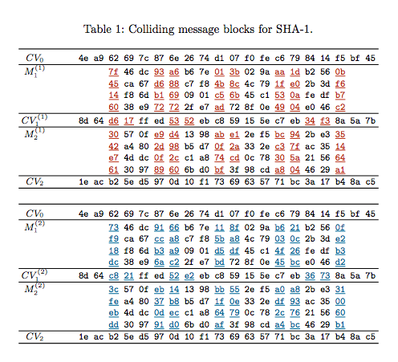

# Catalyst System (150 pts)

This challenge has a simple PHP login form, the input section of which is shown below:

```
<section class="login">
    <div class="title">
        <a href="./index.txt">Level 1</a>
    </div>

    <form method="get">
        <input type="text" required name="name" placeholder="Name"/><br/>
        <input type="text" required name="password" placeholder="Password" /><br/>
        <input type="submit"/>
    </form>
</section>
```

Viewing the index.txt file above, we see the following validation php code:

```
if (isset($_GET['name']) and isset($_GET['password'])) {
    $name = (string)$_GET['name'];
    $password = (string)$_GET['password'];

    if ($name == $password) {
        print 'Your password can not be your name.';
    } else if (sha1($name) === sha1($password)) {
      die('Flag: '.$flag);
    } else {
        print '<p class="alert">Invalid password.</p>';
    }
}
```

Notice that our name and password are cast as strings, and then the SHA1 hashes of these strings are compared against each other. We thus need to find a way to generate a SHA1 collision.

Thankfully, the day before this CTF, Google researchers published a novel attack on SHA1 that they dubbed Shattered with a set of example collisions in this [paper](https://shattered.io/static/shattered.pdf).

The main idea behind this collision is . There are two pairs of blocks, M<sub>1</sub> and M<sub>2</sub>.

CV refers to the internal state of the SHA1 hash, which is a set of five 4-byte variables named A,B,C,D,E. These five variables are updated during the processing of each block. When the final hash is output, it is simply a concatenation of these five variables, giving a 20-byte hash.

What Google has done is, for a chosen prefix, cause a near-collision with the first pair of blocks (M<sub>1</sub>), and then cause a full collision with the M<sub>2</sub> pair.

Two colliding PDFs are given on the [Shattered website](https://shattered.io/).

## Get the flag
These PDFs are too long to be sent to the login form directly. But, note that the PDFs are identical after the colliding blocks above. Thus, all the bytes after the colliding blocks will not cause the SHA1 hashes to differ, so we can remove most of the PDF in a hex editor.

We're left with two 320-byte files, [shattered-1](shattered-2.pdf) and [shattered-2](shattered-2.pdf), that collide.

```
>>> import hashlib
>>> pdf1 = open("shattered-1.pdf", 'r').read()
>>> pdf2 = open("shattered-2.pdf", 'r').read()
>>> print hashlib.sha1(pdf1).hexdigest()
f92d74e3874587aaf443d1db961d4e26dde13e9c
>>> print hashlib.sha1(pdf2).hexdigest()
f92d74e3874587aaf443d1db961d4e26dde13e9c
```

And we can send these files to the server with the Python `requests` library and get the flag!
