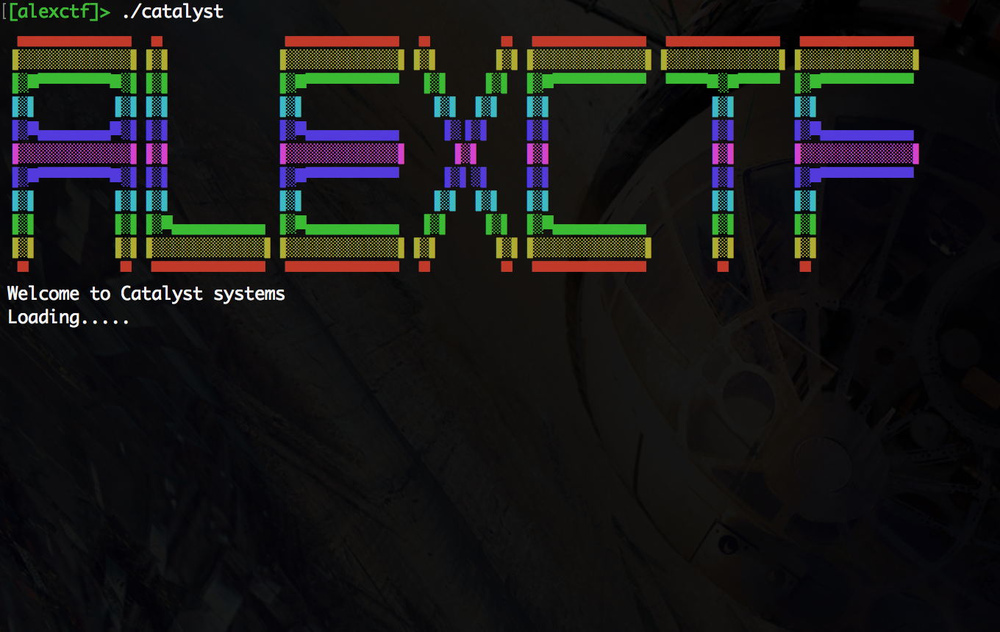
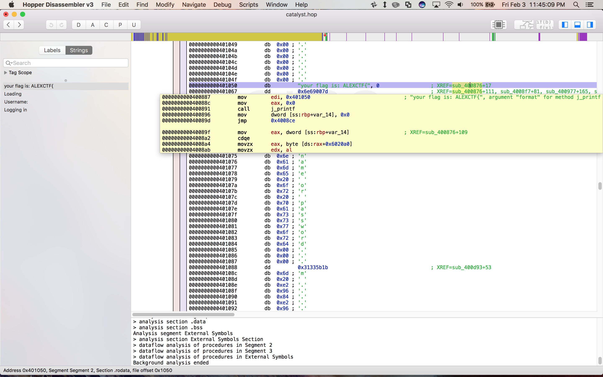
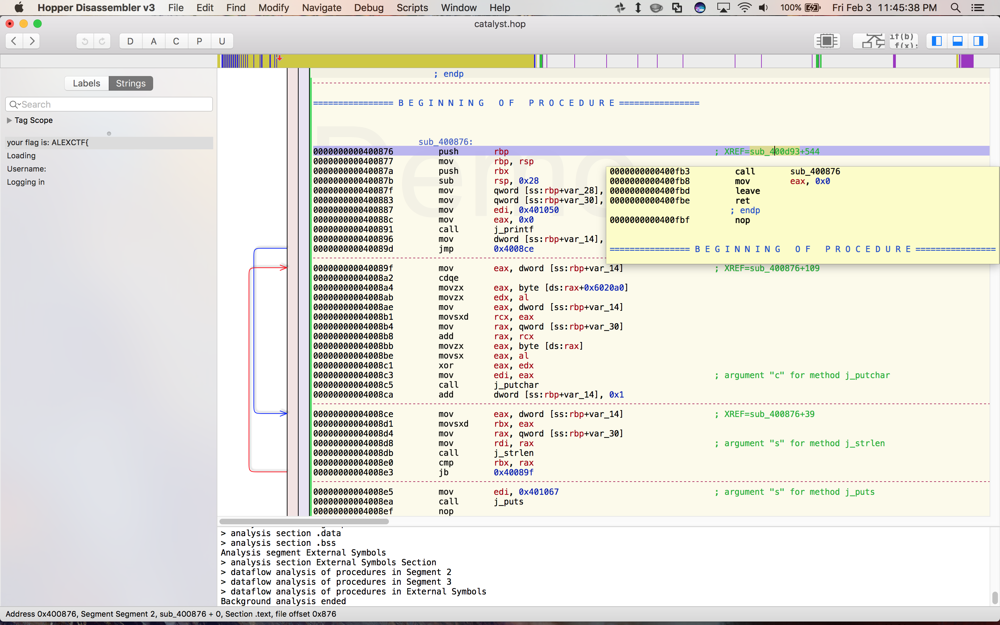
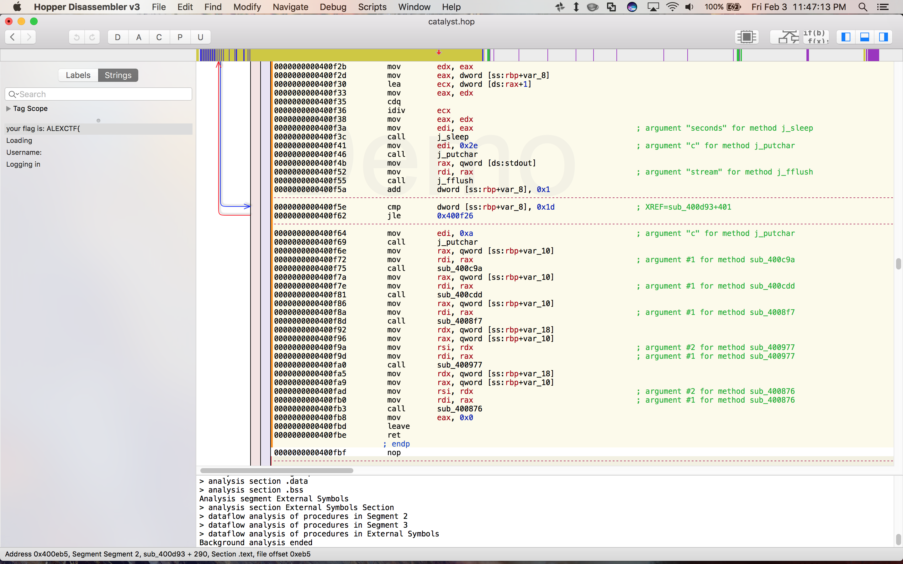
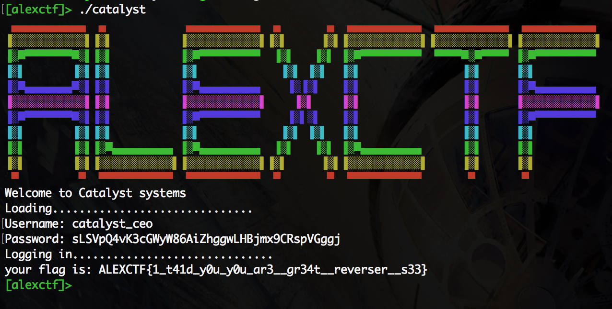

# Catalyst System (150 pts)

Like most reverse engineering challenges, this binary was a "crackme," where the challenge is to find a password that causes the binary to give you the flag. When we ran the binary we saw this:



The "Loading" took a while to finish, but once it did it prompted us for a username and password. If you input a wrong pair, it exits immediately.

I did most of my analysis using [Hopper](https://www.hopperapp.com/), an interactive dissasembler. The first thing I did was open Hopper, select the binary, and look at the "Strings" panel which displays all long runs of valid ASCII characters that it detects in the binary:



Clearly the string `your flag is ALEXCTF{` will be relevant. Hopper shows you where in the assembly the string is referenced and lets you jump to that point:



So if we ever get to this subroutine, the binary will just spit out the flag for us. Helpfully, Hopper also tells you which subroutines call this one, and let you jump to them. After jumping around a little bit, you get a pretty good sense of the control flow at work:

1. First the binary prints out the colorful logo, and then spends a long time "loading" by repeatedly calling `sleep`.
2. Then, it prompts the user for a username and password.
3. Next, it runs a battery of tests against these two strings and exits at the first failure.
4. If all the tests pass, it jumps to the subroutine we found earlier and prints out the flag, which is some function of the username and password.

You can see the four tests it runs here:



Our task is to read the four subroutines (`sub_400c9a`, `sub_400cdd`, `sub_4008f7`, and `sub_400977`) and figure out what they are testing so we can determine a valid username and password.

The first test takes only the username as an argument and immediately computes its length. It then passes this length to another subroutine through the `%edi` register:

```
sub_400c41:
0000000000400c41     push   rbp
0000000000400c42     mov    rbp, rsp
0000000000400c45     sub    rsp, 0x20
0000000000400c49     mov    dword [ss:rbp+var_14], edi   // X = len(username)
0000000000400c4c     mov    eax, dword [ss:rbp+var_14]
0000000000400c4f     sar    eax, 0x2
0000000000400c52     mov    dword [ss:rbp+var_4], eax
0000000000400c55     mov    eax, dword [ss:rbp+var_4]
0000000000400c58     shl    eax, 0x2
0000000000400c5b     cmp    eax, dword [ss:rbp+var_14]   // X = 0 (mod 4)
0000000000400c5e     jne    0x400c83

0000000000400c60     mov    eax, dword [ss:rbp+var_4]
0000000000400c63     sar    eax, 0x2
0000000000400c66     mov    dword [ss:rbp+var_8], eax
0000000000400c69     mov    eax, dword [ss:rbp+var_8]
0000000000400c6c     shl    eax, 0x2
0000000000400c6f     cmp    eax, dword [ss:rbp+var_4]    // X ≠ 0 (mod 16)
0000000000400c72     je     0x400c83

0000000000400c74     mov    eax, dword [ss:rbp+var_4]
0000000000400c77     sar    eax, 0x1
0000000000400c79     test   eax, eax                     // X > 8
0000000000400c7b     je     0x400c83

0000000000400c7d     cmp    dword [ss:rbp+var_8], 0x0    // X < 16
0000000000400c81     je     0x400c97

0000000000400c83     mov    edi, 0x401069
0000000000400c88     call   j_puts
0000000000400c8d     mov    edi, 0x0
0000000000400c92     call   j_exit

0000000000400c97     nop
0000000000400c98     leave
0000000000400c99     ret
   ; endp
```

This subroutine is essentially just a series of checks equivalent to the following:

```
x = len(username)
assert (x >> 2) << 2 == x
y = x >> 2
assert (y >> 2) << y != y
assert (x >> 1) != 0
assert y == 0
```

This code checks that the length is divisible by 4, but not by 16, and that the length is greater than 8 but less than 16. This tells us that the length must be 12.

The second test is a little more interesting:

```
sub_400cdd:
0000000000400cdd     push       rbp
0000000000400cde     mov        rbp, rsp
0000000000400ce1     sub        rsp, 0x30
0000000000400ce5     mov        qword [ss:rbp+var_28], rdi
0000000000400ce9     mov        rax, qword [ss:rbp+var_28]
0000000000400ced     mov        qword [ss:rbp+var_8], rax
0000000000400cf1     mov        rax, qword [ss:rbp+var_8]
0000000000400cf5     mov        eax, dword [ds:rax]
0000000000400cf7     mov        eax, eax
0000000000400cf9     mov        qword [ss:rbp+var_10], rax
0000000000400cfd     mov        rax, qword [ss:rbp+var_8]
0000000000400d01     add        rax, 0x4
0000000000400d05     mov        eax, dword [ds:rax]
0000000000400d07     mov        eax, eax
0000000000400d09     mov        qword [ss:rbp+var_18], rax
0000000000400d0d     mov        rax, qword [ss:rbp+var_8]
0000000000400d11     add        rax, 0x8
0000000000400d15     mov        eax, dword [ds:rax]
0000000000400d17     mov        eax, eax
0000000000400d19     mov        qword [ss:rbp+var_20], rax
0000000000400d1d     mov        rax, qword [ss:rbp+var_10]
0000000000400d21     sub        rax, qword [ss:rbp+var_18]
0000000000400d25     mov        rdx, rax
0000000000400d28     mov        rax, qword [ss:rbp+var_20]
0000000000400d2c     add        rax, rdx
0000000000400d2f     cmp        rax, 0x5c664b56
0000000000400d35     jne        0x400d7c

0000000000400d37     mov        rdx, qword `[ss:rbp+var_10]`
0000000000400d3b     mov        rax, qword [ss:rbp+var_20]
0000000000400d3f     add        rdx, rax
0000000000400d42     mov        rax, rdx
0000000000400d45     add        rax, rax
0000000000400d48     add        rdx, rax
0000000000400d4b     mov        rax, qword [ss:rbp+var_18]
0000000000400d4f     add        rdx, rax
0000000000400d52     movabs     rax, 0x2e700c7b2
0000000000400d5c     cmp        rdx, rax
0000000000400d5f     jne        0x400d7c

0000000000400d61     mov        rax, qword [ss:rbp+var_18]
0000000000400d65     imul       rax, qword [ss:rbp+var_20]
0000000000400d6a     mov        rdx, rax
0000000000400d6d     movabs     rax, 0x32ac30689a6ad314
0000000000400d77     cmp        rdx, rax
0000000000400d7a     je         0x400d90

0000000000400d7c     mov        edi, 0x401069
0000000000400d81     call       j_puts
0000000000400d86     mov        edi, 0x0
0000000000400d8b     call       j_exit

0000000000400d90     nop
0000000000400d91     leave
0000000000400d92     ret
   ; endp
```

Essentially it interprets the 12-character username as three 32-bit integers stored in `[ss:rbp+var_10]`, `[ss:rbp+var_18]`, and `[ss:rbp+var_10]`. Let's call these values A, B, and C respectively. It then computes a series of functions on these three values and verifies that they equal certain constants. Namely:

```
A - B + C        ==  0x5c664b56
B + (A + C) * 3  ==  0x2e700c7b2
B * C            ==  0x32ac30689a6ad314
```

This gives us three equations and three variables, so we can solve them to get: A = 0x61746163, B = 0x7473796c, and C = 0x6f65635f. Putting them all together (and remembering that integers are interpreted as little-endian), we find that the username is `catalyst_ceo`:

```
>>> import struct
>>> ''.join([struct.pack('<I', x) for x in [0x61746163,0x7473796c,0x6f65635f]])
'catalyst_ceo'
```

The third test simply checks that the username consists of only lowercase characters or underscores. The fourth test takes in both the username and password as arguments. It first checks that the password consists of only alphanumeric characters. Then it does something interesting:

```
0000000000400a4c    mov    rax, qword [ss:rbp+var_20]
0000000000400a50    mov    edx, dword [ds:rax]
0000000000400a52    mov    rax, qword [ss:rbp+var_20]
0000000000400a56    add    rax, 0x4
0000000000400a5a    mov    eax, dword [ds:rax]
0000000000400a5c    add    edx, eax
0000000000400a5e    mov    rax, qword [ss:rbp+var_20]
0000000000400a62    add    rax, 0x8
0000000000400a66    mov    eax, dword [ds:rax]
0000000000400a68    add    eax, edx
0000000000400a6a    mov    edi, eax        ; argument "seed" for method j_srand
0000000000400a6c    call   j_srand
0000000000400a71    mov    rax, qword [ss:rbp+var_28]
0000000000400a75    mov    ebx, dword [ds:rax]
0000000000400a77    call   j_rand
0000000000400a7c    sub    ebx, eax
0000000000400a7e    mov    eax, ebx
0000000000400a80    cmp    eax, 0x55eb052a
0000000000400a85    je     0x400a9b

0000000000400a87    mov    edi, 0x401069
0000000000400a8c    call   j_puts
0000000000400a91    mov    edi, 0x0
0000000000400a96    call   j_exit
```

The username is stored at `[ss:rbp+var_20]` and the password at `[ss:rbp+var_28]`. It's computing A + B + C and then seeding the random number generator with this value. It then calls `rand` and subtracts the resulting value from the first 32-bits of the password, checking that the result equals 0x55eb052a.

It then does this over and over again for the subsequent characters of the password. If all the comparisons work out, the subroutine returns and will print out our flag.

We can write a simple C program to seed the generator with the correct value and spit out the first few integers it produces:

```
#include <stdio.h>      /* printf, scanf, puts, NULL */
#include <stdlib.h>     /* srand, rand */

int main ()
{
  unsigned int seed = 0x61746163 + 0x6f65635f + 0x7473796c;

  /* initialize random seed: */
  srand (seed);
  int i;
  for(i = 0; i < 10; i++) {
    printf("0x%x, ", rand());
  }

  return 0;
}
```

We then just need to add these to each of the constants and string the results together:

```
>>> import struct
>>> a = [0x55eb052a, 0xef76c39, 0xcc1e2d64, 0xc7b6c6f5, 0x26941bfa, 0x260cf0f3, 0x10d4caef, 0xc666e824, 0xfc89459c, 0x2413073a]
>>> b = [0x684749, 0x673ce537, 0x7b4505e7, 0x70a0b262, 0x33d5253c, 0x515a7675, 0x596d7d5d, 0x7cd29049, 0x59e72db6, 0x4654600d]
>>> ''.join([struct.pack('<I', (x + y) % (1 << 32)) for (x, y) in zip(a, b)])
'sLSVpQ4vK3cGWyW86AiZhggwLHBjmx9CRspVGggj'
```

Now we have both our username and password, so we can actually just feed them both to the binary and get the flag. The binary intentionally makes this step annoying: because of all the calls to `sleep` you have to wait a while before it prints out the flag. We can either patch the binary to remove these calls, or continue with our static analysis.

Let's do the latter. This is the subroutine that prints out our flag:

```
sub_400876:
0000000000400876    push       rbp
0000000000400877    mov        rbp, rsp
000000000040087a    push       rbx
000000000040087b    sub        rsp, 0x28
000000000040087f    mov        qword [ss:rbp+var_28], rdi
0000000000400883    mov        qword [ss:rbp+var_30], rsi
0000000000400887    mov        edi, 0x401050                               ; "your flag is: ALEXCTF{", argument "format" for method j_printf
000000000040088c    mov        eax, 0x0
0000000000400891    call       j_printf
0000000000400896    mov        dword [ss:rbp+var_14], 0x0
000000000040089d    jmp        0x4008ce

000000000040089f    mov        eax, dword [ss:rbp+var_14]
00000000004008a2    cdqe       
00000000004008a4    movzx      eax, byte [ds:rax+0x6020a0]
00000000004008ab    movzx      edx, al
00000000004008ae    mov        eax, dword [ss:rbp+var_14]
00000000004008b1    movsxd     rcx, eax
00000000004008b4    mov        rax, qword [ss:rbp+var_30]
00000000004008b8    add        rax, rcx
00000000004008bb    movzx      eax, byte [ds:rax]
00000000004008be    movsx      eax, al
00000000004008c1    xor        eax, edx
00000000004008c3    mov        edi, eax                                    ; argument "c" for method j_putchar
00000000004008c5    call       j_putchar
00000000004008ca    add        dword [ss:rbp+var_14], 0x1

00000000004008ce    mov        eax, dword [ss:rbp+var_14]
00000000004008d1    movsxd     rbx, eax
00000000004008d4    mov        rax, qword [ss:rbp+var_30]
00000000004008d8    mov        rdi, rax                                    ; argument "s" for method j_strlen
00000000004008db    call       j_strlen
00000000004008e0    cmp        rbx, rax
00000000004008e3    jb         0x40089f

00000000004008e5    mov        edi, 0x401067                               ; argument "s" for method j_puts
00000000004008ea    call       j_puts
00000000004008ef    nop        
00000000004008f0    add        rsp, 0x28
00000000004008f4    pop        rbx
00000000004008f5    pop        rbp
00000000004008f6    ret        
   ; endp
```

The username is stored at `[ss:rbp+var_28]` and the password at `[ss:rbp+var_30]`. This function just iterates over the password string, and xors it character by character against a string stored at `[ds:0x6020a0]`. We can simulate this pretty fast in python:

```
>>> s = "42 13 27 62 41 35 6B 0F 7B 46 3C 3E 67 0C 08 59 44 72 36 05 0F 15 54 43 38 17 1D 18 08 0E 5C 31 21 16 02 09 18 14 54 59"
>>> x = [int(a, 16) for a in s.split(' ')]
>>> p = 'sLSVpQ4vK3cGWyW86AiZhggwLHBjmx9CRspVGggj'
>>> ''.join([chr( ord(p[i]) ^ x[i]) for i in range(len(p))])
'1_t41d_y0u_y0u_ar3__gr34t__reverser__s33'
```

Our flag is `ALEXCTF{1_t41d_y0u_y0u_ar3__gr34t__reverser__s33}`. This is confirmed by the binary:


