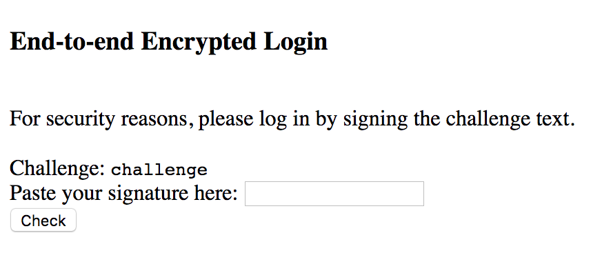
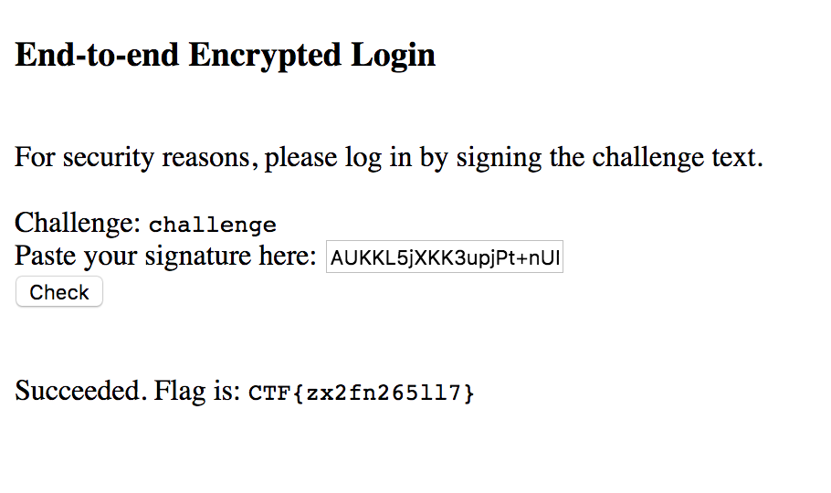

# RSA CTF Challenge (Crypto)

We are first presented with a simple HTML form that asks us to sign the word `challenge` in order to login.



If we look at the source of the page, we find a hidden div that includes an RSA public key and references to base64 encoding and [PKCS1v1.5](https://tools.ietf.org/html/rfc2313) / MD5.

Our goal then seems to be to forge a signature for `challenge` in PKCS1v1.5 format that will be accepted by the given public key.

If done properly, this is impossible, but because PKCS1v1.5 is such a brittle scheme, minor errors in its implementation can result in [major](https://www.ietf.org/mail-archive/web/openpgp/current/msg00999.html) [security](http://archiv.infsec.ethz.ch/education/fs08/secsem/bleichenbacher98.pdf) [vulnerabilities](https://eprint.iacr.org/2012/417.pdf).

## PKCS1v1.5

Before we talk about the implementation error, let's first describe how PKCS1v1.5 works.

A PKCS1v1.5 block looks like this:

`00 || BT || PS || 00 || D`

where:
 - `BT` is the block type and is 01 for private key operations (digital signatures) and 02 for public key operations (encryption)
 - `PS` is the padding string and consists of $`k - 3 - |D|`$ bytes where $k$ is the byte-length of the RSA modulus. For block type 01, the padding bytes should all be FF and for block type 02, the padding bytes should be "pseudorandomly generated and nonzero."
 - `D` is the actual data in question.

For digital signatures `D` is an ASN.1 encoded value that includes information about the hash function used and the hash of the message to be signed. For our purposes,

`D = 3020300c06082a864886f70d020505000410 || MD5('challenge')`

To create an RSA signature, we construct a PKCS1v1.5 block of the above format, treat it as an integer $`c`$, and compute $`m = c^d (\mathrm{mod} \  n)`$. The result $`m`$ is our signature.

## The Vulnerability

We aren't given the source code for the signature validator, so we must do some guesswork on the implementation error. The HTML form makes a reference to "End-to-End Encryption" even though the challenge involves signatures, not encryption.

Perhaps it's possible that the website builders confused RSA Encryption with RSA Signatures and used the wrong type of PKCS1v1.5 padding. Specifically, instead of checking that the padding string consisted of only FF bytes, maybe they treated it as if it was block type 02 and just checked that it had only nonzero bytes.

How can we take advantage of this? On it's own this doesn't help us, but when combined with the fact that the RSA public exponent is very small ($`e = 3`$), it becomes relatively straightforward to forge valid signatures.

If we can craft a padding string such that the resulting PKCS1v1.5 block is a perfect cube, we can simply take the cube root of it and use it as our signature $`m`$. Then, the validator will compute $`m^e (\mathrm{mod} \  n) = m^3`$, and the result will be our crafted block.

## The Attack

We need to find a 1024-bit perfect cube with leading bytes `00 01` and trailing bytes equal to `00 || D`. The attack is outlined in [this Stack Exchange post](https://crypto.stackexchange.com/questions/14875/attack-of-an-rsa-signature-scheme-using-pkcs1-v1-5-encryption-padding); we'll have to modify it slightly for this challenge.

Let's start with the trailing bytes condition. `00 || D` is $`1 + 18 + 16 = 35`$ bytes $`= 280`$ bits long, so this condition is equivalent to saying that that our cube modulo $`2^{280}`$ should equal D. Let's call our cube $`x^3`$ and let's represent D as the variable $`d`$.

We want:

```math
x^3 = d (\mathrm{mod} \  2^{280})
```
Elementary number theory tells us that if $`v`$ is the inverse of $`3`$ modulo $`\phi(2^{280})`$, Then

```math
x = d^v (\mathrm{mod} \  2^{280})
```

(This only works if $`d`$ has a modular cube root, which is true only for odd $`d`$. Happily, our $`d`$ is odd.)

Next, let's consider the leading bytes condition. This can be formulated mathematically as
```math
2^{1008} \le x^3 < 2 \cdot 2^{1008}
```
```math
\sqrt[3]{2^{1008}} \le x < \sqrt[3]{2 \cdot 2^{1008}}
```

(The $`1008`$ comes from the fact that length of the padding plus the trailing bytes is $`1024 - 2 \cdot 8 = 1008`$ bits).

So to finish, we just need to find an $`x`$ that satisfies both of these mathematical conditions. We can do this by picking any $`x`$ in the interval, and adjusting it slightly so that it equals $`d^v`$ modulo $`2^{280}`$. The resulting number's cube should have the appropriate leading and trailing bytes.

There's actually one more condition that we've ignored so far: the padding string shouldn't contain any null bytes. This will happen by chance with probability $`(255/256)^{91} \approx 70\%`$ so we can just try a bunch of candidates until one works.

## The code
You can find a simple python script to compute the signature [here](https://github.com/TechSecCTF/writeups/blob/master/googlectf2017/rsa_ctf_challenge/script.py). The key section is reproduced below:

```
# First compute the required end of message block
asn_prefix = b'003020300c06082a864886f70d020505000410'
md5_hash = hashlib.md5(b'challenge').hexdigest()
data = asn_prefix + md5_hash.encode('utf-8')
d = int(data, 16)

# Next compute the cube root of this number modulo 2^280
bits = 280
m = pow(2, bits)
t = pow(2, bits) - pow(2, bits - 1)
z = cube_root_mod(d, m, t)

# Pick a number between (2^1008)^(1/3) and (2*2^1008)^(1/3) and adjust
# it to equal to z modulo 2^280
i = 1 # some i's produce blocks with extra null bytes; adjust until lucky
x = iroot(3, 2 * pow(2, 1008))
x = x - (x % m) + z - i*m

# Check that the cube of x matches the PKCS1v1.5 format:
y = pow(x, 3)
signature = int_to_bytes(y)
assert len(signature) == 127 # leading byte is 00
assert signature[0] == 1 # second byte is 01
assert binascii.hexlify(signature).endswith(data) # ends in asn prefix + hash
assert 0 not in signature[:-len(data)//2] # no zero byte until the asn prefix

# Print out base64 version of "encrypted" signature
print(base64.b64encode(int_to_bytes(x)).decode('utf-8'))
```

The script produces the integer

```
x = 176368846691323817807583646497896249461582346736585043753352378054480534894624774082565108943018895713
```

which, when converted to a byte string and base64 encoded is:

```
AUKKL5jXKK3upjPt+nUNI8iXdZSASpmMLeHoAi4zdZ3XEyfjVk0NxdGpYQ==
```

Submitting this signature to the website yields the flag `CTF{zx2fn265117}`:


