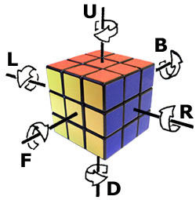

# Rubik (Crypto)

We are given some [Rust code](handshake.rs) that implements a version of [Stickel's Key Exchange protocol](https://en.wikipedia.org/wiki/Non-commutative_cryptography#Stickel.E2.80.99s_key_exchange_protocol) for the [Rubik's Cube Group](https://en.wikipedia.org/wiki/Rubik%27s_Cube_group).

We are also given a service which executes this protocol and allows users to register public keys and login.

Before we dive into the details of the protocol and the attack, let's talk a little bit about Rubik's Cubes.

## Rubik's Cube Theory

To talk about a series of moves that can be applied to a Rubik's Cube, most people use [Singmaster Notation](https://en.wikipedia.org/wiki/Rubik%27s_Cube#Move_notation). The six letters `R`, `L`, `U`, `D`, `F`, and `B` describe 90 degree clockwise turns to each of the six faces. A prime (') after a letter indicates a counter-clockwise turn. Finally, the letters `x`, `y`, and `z`, describe rotating the entire cube 90 degrees clockwise on the `R`, `U`, and `F` faces respectively. A prime after these letters describes the corresponding counter-clockwise rotation.



[This site](https://ruwix.com/the-rubiks-cube/notation/) allows you to apply a series of moves to a cube to explore the notation.

For the purposes of the protocol there are really only two important operations: $X$ = `U x'` and $Y$ = `L y'`. We'll borrow notation from group theory to talk about composing these operations. For example, $X^2$ represents the operation `U x' U x'`, and $X \cdot Y^3$ represents the operation `U x' L y' L y' L y'`.

Note that in general Rubik's Cube moves do not commute, so $X \cdot Y \neq Y \cdot X$. Finally, the _inverse_ of an operation is the operation that exactly undoes it, so the inverse of $Y$ is $Y^{-1}$ = `y L'`.

Another important concept from group theory is that of the _order_ of an element, which is simply the number of times we need to compose an element with itself until we produce the identity element.

It turns out that the orders of $X$ and $Y$ are both 1260, which also happens to be the maximum possible order of any element of the Rubik's Cube group. (We actually verified this manually by applying `U x'` repeatedly to a physical cube and noticing that after 420 operations the cube returned to its original state with three corners rotated 120 degrees clockwise.)

## The Protocol

The protocol allows two users, Alice and Bob, to agree upon a shared secret. Each user's private key is a pair of 64-bit numbers $(a, b)$. The corresponding public key is the Rubik's cube state corresponding to the permutation

\[P = X^a  \cdot Y^b\]

Namely, apply `U x'` $a$ times and then apply `L y'` $b$ times.

Let Alice's parameters be $(a_A, b_A, P_A)$, where $(a_A, b_A)$ is her private key and $P_A$ is her public key. Define $(a_B, b_B, P_B)$ similarly for Bob. To agree on a shared secret, Alice and Bob exchange their public keys, and Alice computes:

\[S_A = X^{a_A}  \cdot P_B \cdot Y^{b_A}\]

and Bob computes:

\[S_B = X^{a_B}  \cdot P_A \cdot Y^{b_B}\]

Note that

\[S_A = X^{a_A}  \cdot P_B \cdot Y^{b_A} = X^{a_A}  \cdot X^{a_B}  \cdot Y^{b_B} \cdot Y^{b_A} = X^{a_A + a_B} \cdot Y^{b_A + b_B}\]

\[S_B = X^{a_B}  \cdot P_A \cdot Y^{b_B} = X^{a_B}  \cdot X^{a_A}  \cdot Y^{b_A} \cdot Y^{b_B} = X^{a_B + a_A} \cdot Y^{b_B + b_A}\]

Thus, $S_A = S_B$. In the service, this shared secret is then hashed with a random salt to produce the authentication token.

The service represents the state of a Rubik's cube by listing out the colors of the 54 squares in a particular order. The starting solved state of the cube corresponds to the white face being `U`, the red face being `F`, and the the blue face being `R`.

## Logging In

We now understand enough to register an account with the service and then login:

```
Welcome to the Rubik's cube authentication server!

You have the following options:
1) Public key service
2) Register
3) Login
q) Quit
2
What username do you want to register?
x
What public key do you want to register?
WWWWWWWWWGGGRRRBBBOOOGGGRRRBBBOOOGGGRRRBBBOOOYYYYYYYYY
User registered!
```
We'll set our public key to the solved Rubik's Cube state `WWWWWWWWWGGGRRRBBBOOOGGGRRRBBBOOOGGGRRRBBBOOOYYYYYYYYY`, which corresponds to the private key $(0,0)$. This allows us to compute the handshake simply by taking the hash of the service's public key: $S = X^{a_B} \cdot X^0Y^0 \cdot Y^{a_B} = X^{a_B} \cdot Y^{a_B} = P_B$.

```
You have the following options:
1) Public key service
2) Register
3) Login
q) Quit
3
What user do you want to log in as?
x
My public key is:
YRBBWWGRWRYOYBOGGWRGBOOGOGYRRWRBYBBGRYWROOYOOYGGWYBWWB

Please give me the result of:
mykey.handshake(yourkey, "036e4e0a57cf8d05".from_hex().unwrap()).to_hex()
1d740d43446f1755ec2fb066c2314444
Your are now logged in!
```
We compute the handshake with a short python snippet:
```
[rubik]> python3
Python 3.6.1 (default, Apr  4 2017, 09:40:51)
>>> import binascii
>>> import hashlib
>>> salt = binascii.unhexlify("036e4e0a57cf8d05")
>>> state = b"YRBBWWGRWRYOYBOGGWRGBOOGOGYRRWRBYBBGRYWROOYOOYGGWYBWWB"
>>> hashlib.blake2b(state, digest_size=16, key=salt).hexdigest()
'1d740d43446f1755ec2fb066c2314444'
```
Once we login we notice that we now have a fourth option in the service: `List users`. Doing so, shows us that there are two users, our own account and `admin`:
```
You have the following options:
1) Public key service
2) Register
3) Login
4) List users
q) Quit
4
List of registered users:
Username: x
Key: WWWWWWWWWGGGRRRBBBOOOGGGRRRBBBOOOGGGRRRBBBOOOYYYYYYYYY

Username: admin
Key: BGWYROYRWYRRGBRBGBOYRGWRWGGWYOYBROBOYWOGBRGYGBOYWOOWBW
```

Clearly, we must log-in as `admin` to get the flag. To do so, we need to break the protocol and determine a private key from a given public key.

## The Attack

To log in as admin, we will need to provide the handshake between the admin and the service. A naive approach would be, for both the admin and the service, to iterate through all possible $(a, b)$ pairs applying $X^a \cdot Y^b$ to a solved cube and check if the resulting state equals their respective public keys. At first it would seem that this would require $2^{64} \cdot 2^{64}$ checks, because $a$ and $b$ are 64-bit integers, but since the orders of $X$ and $Y$ are much smaller, we actually only have to check integers in the range $[0, 1259]$. This requires only $1260^2$ checks, which is very feasible.

In fact, we can do even better using a [Meet-in-the-Middle attack](https://en.wikipedia.org/wiki/Meet-in-the-middle_attack): we first generate the set of all states given by $X^a$ for $a \in [0, 1259]$. Then we generate the set of all states given by $P \cdot Y^{-b}$ for $b \in [0, 1259]$ and look for an intersection in the two sets.

An intersection means that we found an $(a,b)$ pair such that:

\[X^a = P \cdot Y^{-b} \implies X^a Y^b = P.\]


This is an example of a [space-time tradeoff](https://en.wikipedia.org/wiki/Space%E2%80%93time_tradeoff) which allows us to turn a $O(n^2)$ time and $O(1)$ space algorithm into a $O(n)$ time and $O(n)$ space algorithm.

The Rust libraries used by the provided code don't seem to actually exist, so we needed to implement the protocol and the attack ourselves. We wrote some [python code](meet_middle.py#L5) that applied the `U`, `L'`, `x'`, and `y` moves to a cube state and carried out the attack.

Interestingly, while the attack always worked on the service's public key, it never seemed to work on the admin's public key. Since our attack tries literally all possible $X^a Y^b$ states, this suggests that the admin's public key isn't a Rubik's Cube permutation of the specified form.

This ends up not being a major obstacle: suppose the service's public key is $P = X^a Y^b$ and the admin's public key is some arbitrary permutation $Q$. The service will compute the state:

\[S = X^a \cdot Q \cdot Y^b\]

and since we can determine $a$ and $b$ and know $Q$, we can compute $S$ as well.

The trickiest part of this is being able to turn $Q$, which we only know as a Rubik's cube _state_ into the _permutation_ that corresponds to that state. This is possible with some careful [code](meet_middle.py#L217) that tracks how the corners, edges and faces move around from the starting state to $Q$, and applying that same permutation to the state $X^a$.

Once we do this and successfully login as admin, we are given the flag `CTF{StickelsKeyExchangeByHand}`:

```
What user do you want to log in as?
admin
My public key is:
WOWOWROWOOYBYGGWGRBBBYBRBOWRGWORBYWYGROGOWRGBRYYBYGRYG

Please give me the result of:
mykey.handshake(yourkey, "d4692ecfacd26020".from_hex().unwrap()).to_hex()
1fcd6bff7db21286935ada6004ca8593
Your are now logged in!
Here is the flag: CTF{StickelsKeyExchangeByHand}
You have the following options:
1) Public key service
2) Register
3) Login
4) List users
q) Quit
```

You can find the complete code for the attack [here](meet_middle.py).
