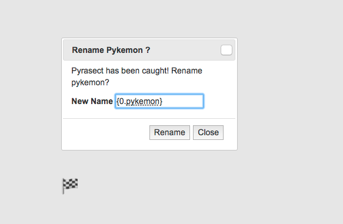
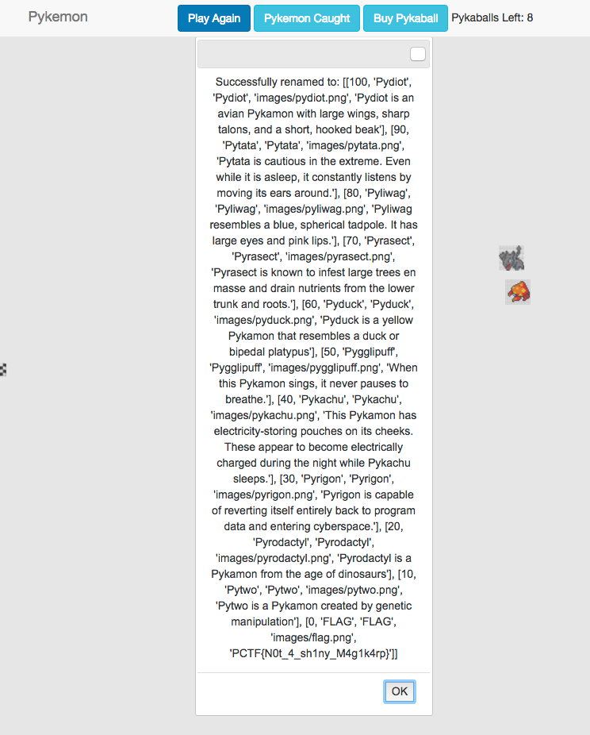

# pykemon (151 pts)

We're given the source code for a [flask](http://flask.pocoo.org/) webapp that allows you to catch pykemon. Each pykemon has a rarity, and the FLAG pykemon, whose decription is the flag, has rarity 0, which means we can never successfully capture it.

Combing through the source code line by line, we find something suspicious:

```
@app.route('/rename/', methods=['POST'])
def rename():
    name = request.form['name']
    new_name = request.form['new_name']
    if not name:
        return 'Error'

    p = check(name, 'caught')
    if not p:
        return "Error: trying to name a pykemon you haven't caught!"

    r = session.get('room')
    s = session.get('caught')
    for pykemon in s['pykemon']:
        if pykemon['pid'] == name:
            pykemon['nickname'] = new_name
            session['caught'] = s
            print session['caught']
            return "Successfully renamed to:\n" + new_name.format(p)
```

When you capture a pykemon, the app lets you rename it to a string of your choice. When you do it returns `new_name.format(p)` where `p` is the python Pykemon object. 

For whatever reason, the user-provided string `new_name` is being formatted with `p` using python's [format string capabilities](https://docs.python.org/2/library/string.html#custom-string-formatting).

It turns out that given an object, python allows you to print out attributes of the object using some special format string syntax. Examining the `Pykemon` class, we notice that if we can get access to the `Pykemon.pykemon` table, we can find the flag.

This ends up working perfectly:



We catch (any) pykemon, and we rename it to `{0.pykemon}`. The `0` refers to the first (and only) format string argument, and and the `.pykemon` tells python to print the pykemon table in the Pykemon class.



This yields the flag: `PCTF{N0t_4_sh1ny_M4g1k4rp}`.

*Note: it turns out that there was an unintended, and arguably easier solution. Flask session cookies are not actually secure, so it's possible to simply [grab and decode](https://github.com/p4-team/ctf/tree/master/2017-04-21-plaidctf/pykemon) the session cookie to find the flag.*

