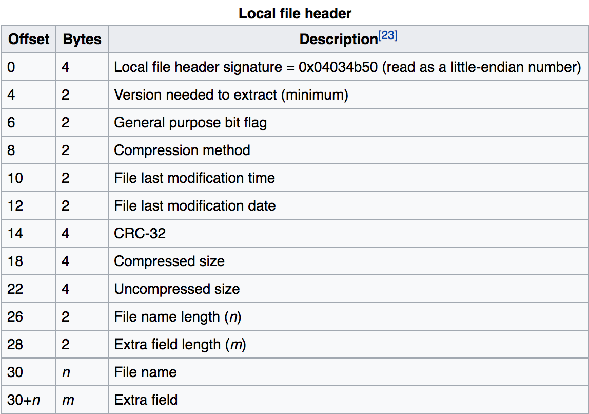

# zipper (50 pts)

We're given a zip archive that is corrupted. When we try to unzip it we get an error:

```
[zipper]> unzip zipper.zip 
Archive:  zipper.zip
warning:  filename too long--truncating.
[  ]
:  bad extra field length (central)
```

We can get a hexdump of the file and examine it byte by byte against the zip spec to diagnose the problem:

```
[zipper]> xxd zipper.zip > zipper_xxd
[zipper]> cat zipper_xxd
00000000: 504b 0304 1400 0200 0800 fc99 924a 3ea9  PK...........J>.
00000010: 2e53 4600 0000 f600 0000 2923 1c00 0000  .SF.......)#....
00000020: 0000 0000 0000 5554 0900 035b c8f6 585b  ......UT...[..X[
00000030: c8f6 5875 780b 0001 04e8 0300 0004 e803  ..Xux...........
00000040: 0000 5350 2004 b814 082b f128 adaa 4acc  ..SP ....+.(..J.
00000050: d051 a8cc 2f55 c848 2c4b 5548 4e2c 2829  .Q../U.H,KUHN,()
00000060: 2d4a 4d51 28c9 4855 48cb 494c b7e2 0a70  -JMQ(.HUH.IL...p
00000070: 0e71 ab4e 3328 4acd 2b36 4c2e 8eaf 4cac  .q.N3(J.+6L...L.
00000080: ac25 c326 ea28 0100 504b 0102 1e03 1400  .%.&.(..PK......
00000090: 0200 0800 fc99 924a 3ea9 2e53 4600 0000  .......J>..SF...
000000a0: f600 0000 2923 1800 0000 0000 0100 0000  ....)#..........
000000b0: b481 0000 0000 0000 0000 0000 0000 5554  ..............UT
000000c0: 0500 035b c8f6 5875 780b 0001 04e8 0300  ...[..Xux.......
000000d0: 0004 e803 0000 504b 0506 0000 0000 0100  ......PK........
000000e0: 0100 4e00 0000 8800 0000 0000            ..N.........
```



Alternatively, we can create a zip archive of our own and compare it against this archive:

```
[zipper]> echo asdfalsjdfklasdlkfj > asdf
[zipper]> zip asdf
  adding: asdf (stored 0%)
[zipper]> xxd asdf.zip
00000000: 504b 0304 0a00 0000 0000 87b2 974a e5c4  PK...........J..
00000010: 6545 1400 0000 1400 0000 0400 1c00 6173  eE............as
00000020: 6466 5554 0900 03dd 60fd 58cf 60fd 5875  dfUT....`.X.`.Xu
00000030: 780b 0001 04f5 0100 0004 1400 0000 6173  x.............as
00000040: 6466 616c 736a 6466 6b6c 6173 646c 6b66  dfalsjdfklasdlkf
00000050: 6a0a 504b 0102 1e03 0a00 0000 0000 87b2  j.PK............
00000060: 974a e5c4 6545 1400 0000 1400 0000 0400  .J..eE..........
00000070: 1800 0000 0000 0100 0000 a481 0000 0000  ................
00000080: 6173 6466 5554 0500 03dd 60fd 5875 780b  asdfUT....`.Xux.
00000090: 0001 04f5 0100 0004 1400 0000 504b 0506  ............PK..
000000a0: 0000 0000 0100 0100 4a00 0000 5200 0000  ........J...R...
000000b0: 0000
```

Based on the warning message ('filename too long') and using either or both of the above methods, we can hone in on the problem: bytes 26-27 are supposed to store the filename length, but for the given archive that length is 0x2329 = 9001 (haha).

We can infer the correct length of the filename from the fact that the "Extra field" which has the magic number 5554 occurs right after the filename ends. This means that the filename itself spans bytes 30 to 37 inclusive, meaning that it is eight bytes long.

Note also that the filename occurs twice in the zip archive (not actually sure why...) so we need to make our edits twice.

We can edit `zipper_xxd` directly and change bytes 26-27 and 164-165 to `0800` (remember that it's little endian!). We'll also make the filename `AAAAAAAA` by changing all the bytes from 30-37 and 182-189 inclusive to 0x41:

```
[zipper]> cat zipper_xxd 
00000000: 504b 0304 0a00 0200 0800 fc99 924a 3ea9  PK...........J>.
00000010: 2e53 4600 0000 f600 0000 0800 1c00 4141  .SF.......)#....
00000020: 4141 4141 4141 5554 0900 035b c8f6 585b  ......UT...[..X[
00000030: c8f6 5875 780b 0001 04e8 0300 0004 e803  ..Xux...........
00000040: 0000 5350 2004 b814 082b f128 adaa 4acc  ..SP ....+.(..J.
00000050: d051 a8cc 2f55 c848 2c4b 5548 4e2c 2829  .Q../U.H,KUHN,()
00000060: 2d4a 4d51 28c9 4855 48cb 494c b7e2 0a70  -JMQ(.HUH.IL...p
00000070: 0e71 ab4e 3328 4acd 2b36 4c2e 8eaf 4cac  .q.N3(J.+6L...L.
00000080: ac25 c326 ea28 0100 504b 0102 1e03 1400  .%.&.(..PK......
00000090: 0200 0800 fc99 924a 3ea9 2e53 4600 0000  .......J>..SF...
000000a0: f600 0000 0800 1800 0000 0000 0100 0000  ....)#..........
000000b0: b481 0000 0000 4141 4141 4141 4141 5554  ..............UT
000000c0: 0500 035b c8f6 5875 780b 0001 04e8 0300  ...[..Xux.......
000000d0: 0004 e803 0000 504b 0506 0000 0000 0100  ......PK........
000000e0: 0100 4e00 0000 8800 0000 0000            ..N.........
```

Then we can pack it back into a binary file using the nifty `-r` option of `xxd`. Unzipping the new archive yields the flag:

```
[zipper]> xxd -r zipper_xxd > myzip.zip
[zipper]> unzip myzip.zip 
Archive:  myzip.zip
  inflating: AAAAAAAA
[zipper]> cat AAAAAAAA 
                                  
                                  
Huzzah, you have captured the flag:
PCTF{f0rens1cs_yay}               
                                  
                                  
                                  
```
